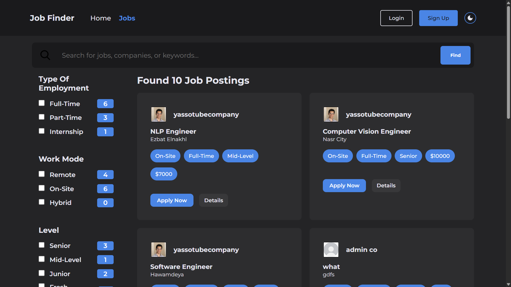

# JobSearch Platform

JobSearch is a full-featured Django web application for job seekers and companies. It allows users to register as job seekers or company administrators, manage profiles, and post or search for jobs. The platform integrates Google OAuth for easy authentication and provides a modern, responsive user experience.




---

## Features

- **User Registration:** Sign up as a regular user or company admin, with dynamic profile creation.
- **Google OAuth Integration:** Quick and secure signup/login via Google accounts.
- **Company Management:** Company admins can create and manage company profiles and job postings.
- **Job Search & Filtering:** Advanced filtering options for job seekers.
- **Email Notifications:** Automated emails for important actions.
- **Secure Authentication:** Built with Django Allauth and custom adapters.
- **Responsive UI:** Clean, mobile-friendly interface.

---

## Project Structure

```
JobSearch/
├── base/                       # Main Django app: models, views, forms, admin, etc.
│   ├── adapters.py
│   ├── forms.py
│   ├── middleware.py
│   ├── models.py
│   ├── urls.py
│   ├── views.py
│   └── ...
├── JobSearch/                  # Project settings and configuration
│   ├── __init__.py
│   ├── asgi.py
│   ├── settings.py
│   ├── urls.py
│   └── wsgi.py
├── templates/                  # HTML templates
│   ├── layout.html
│   ├── socialaccount/
│   │   ├── signup.html
│   │   └── authentication_error.html
│   └── ...
├── static/                     # Static files (CSS, JS, images)
│   └── ...
├── image.png                   # Project screenshot
├── manage.py
└── requirements.txt
```

---

## Technologies Used

- **Backend:** Django, Django Allauth, Python
- **Authentication:** Google OAuth
- **Frontend:** HTML, CSS, JavaScript
- **Database:** SQLite (default, can be changed)
- **Other:** Email backend, custom middleware/adapters

---

## Getting Started

1. **Clone the repository:**
    ```sh
    git clone https://github.com/Momen-Abdelkader/Job-Finder.git
    cd JobSearch
    ```

2. **Install dependencies:**
    ```sh
    pip install -r requirements.txt
    ```

3. **Apply migrations:**
    ```sh
    python manage.py migrate
    ```

4. **Run the development server:**
    ```sh
    python manage.py runserver
    ```

5. **Access the app:**  
   Open [http://127.0.0.1:8000/](http://127.0.0.1:8000/) in your browser.

---

## License

This project is licensed under the MIT License.  
See the [LICENSE](LICENSE) file for details.
